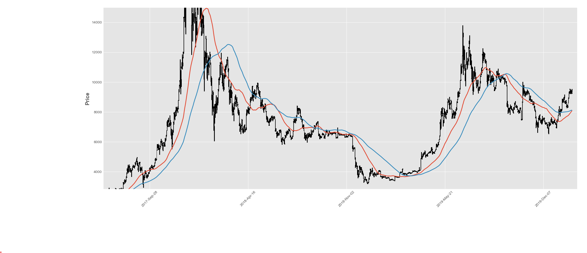
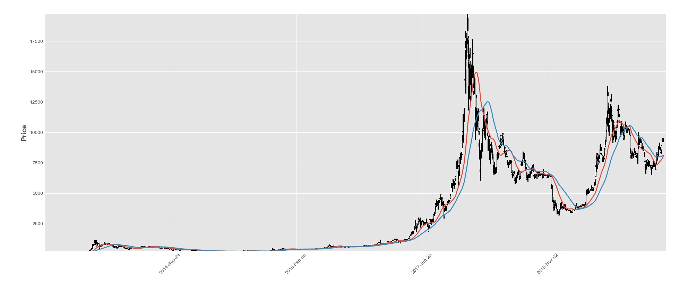

# Historical data of Bitcoin prices converted to a chart with moving averages
# Challenges: The data I obtained could not be taken from beginning to end, So I had to reverse it. The dates were also not in a python friendly style. Creating the csv file to the perfect method for the visuals was Difficult, but fun. Webscrapping the data of CoinMarketCap was preety easy and straightfoward.

