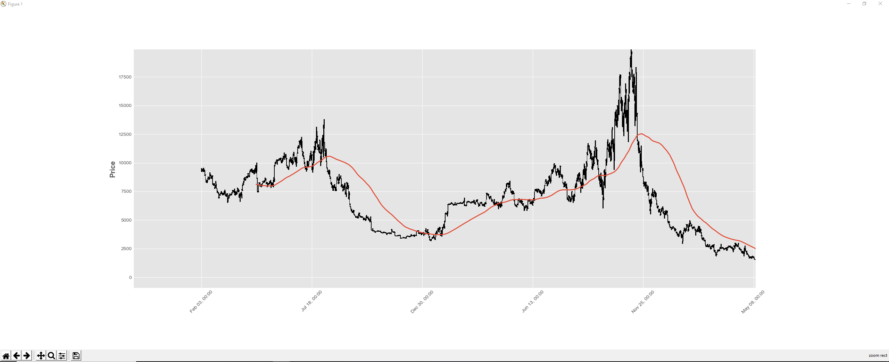

# Historical data of Bitcoin prices converted to a chart with moving avarages 
# Not finished, Current Project.
# Ran into issue, python does not understand dates in the format I collected it in. Example " Feb 01 05 2015 " need to conver them first and then work on the chart 
#
 
